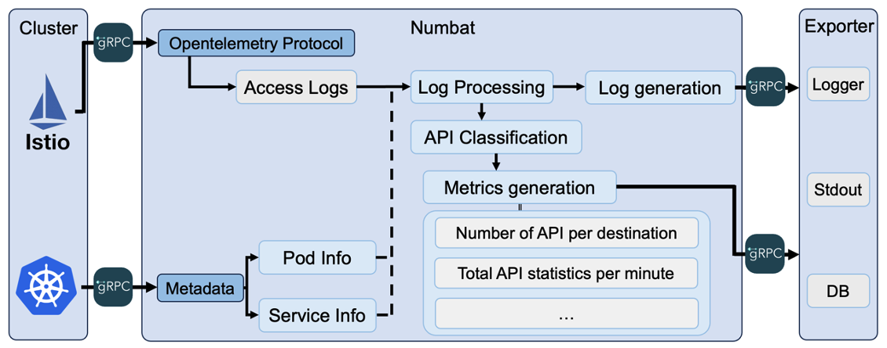

# Numbat : API Observability for 5G
 

Numbat efficiently preprocesses log data , produces API-related metrics, and performs additional exporting. Here's an overview:

## Log Generation:
Numbat preprocesses log data with the following goals:

- Parsing and Extraction: Extracts crucial information from log data and parses it into a structured format.
- Normalization: Standardizes log data formats for consistency and ease of subsequent analysis.

## API Metric Generation:
In the Numbat project, various metrics related to APIs are generated by API Classification.
These metrics measure various aspects of API calls, and the data can be stored for future analysis.

## Exporting:
Numbat performs the following tasks to share or store generated log and metric data.

- Exporter Configuration: Configures settings based on the backend where log and metric data will be stored.
- Data Transmission: Transmits log and metric data to the configured exporting backend for storage or integration with other systems.

## Document:
- [Getting Started](docs/Getting_Started.md)

## Examples:
- [Nephio](examples/nephio): Collecting `free5gc-cp` logs from Nephio using Numbat
