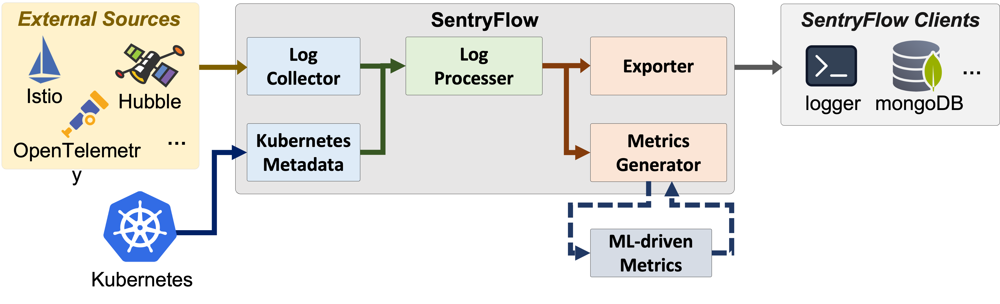

# SentryFlow

  

SentryFlow is a cloud-native system for API observability and security, specializing in log collection, metric production, and data exportation.

## Architecture Overview

### Features
- Generation of API Access Logs
- Proudction of API Metrics and Statistics
- Inference of API Specifications

## Documentation

### Basic Information
- [Getting Started](docs/getting_started.md)
- [Use Cases](examples/README.md)

### Contribution
- [Contribution Guide](contribution/README.md)
